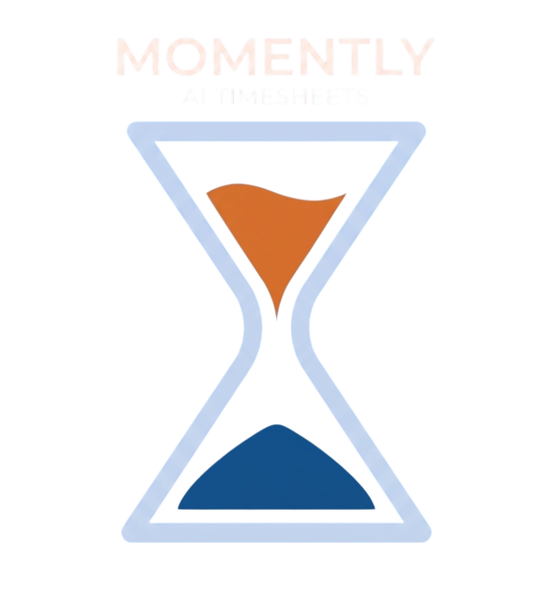

<p align="center">
  
</p>

<p align="center">Every moment counts</p>
<p align="center">Team Cybernauts · COS 301 · University of Pretoria · 2026</p>

<h1 align="center">Design</h1>

## Table of Contents

1. [Design Philosophy](#1-design-philosophy)
2. [Brand Identity](#2-brand-identity)
3. [Colour System](#3-colour-system)
4. [Typography System](#4-typography-system)
5. [Layout & Spacing](#5-layout--spacing)
6. [Wireframes & Screen Justification](#6-wireframes--screen-justification)
7. [Component System](#7-component-system)
8. [Use Case to UI Mapping](#8-use-case-to-ui-mapping)
9. [Responsive Strategy](#9-responsive-strategy)
10. [Accessibility](#10-accessibility)


## 1. Design Philosophy

Momently's design language is built on a single conviction: **time tracking should feel like a power tool, not a compliance form.** Where most timesheet tools are grey, dense, and bureaucratic, Momently is clear, warm, and intelligent: surfacing insights rather than demanding data entry.

Three principles guide every screen:

| Principle | Meaning |
|---|---|
| **Clarity over density** | Every element on screen earns its space. If it does not help the user understand or act, it is removed. |
| **Momentum, not friction** | Logging time, starting a timer, or reviewing a timesheet should take as few taps as possible. The flow must feel effortless. |
| **Intelligence at the surface** | AI suggestions are first-class citizens: shown in the sidebar and inline, never buried in a settings menu. |


## 2. Brand Identity

### The Name

<p align="center">
  
</p>

**momently**: lowercase `m`, deliberately human.

The name mirrors Momentum Life's own brand convention of a lowercase-first wordmark. Starting with a lowercase letter signals that this tool belongs in a developer's daily flow, not in an HR filing cabinet. It is approachable by design.

### The Logo

The logo is a reimagined hourglass rendered in the brand's two primary colours:

- The **upper chamber** fills with **Chocolate orange (`#E07830`)**: representing raw, unlogged work in motion.
- The **lower chamber** settles into **Steel Azure (`#0F4C91`)**: representing captured, structured, committed time.

The metaphor is deliberate: Momently does not watch time drain away. It converts effort into evidence.

<p align="center">
  
</p>

### The Slogan

Every moment counts.

This is not a marketing line: it is the product's thesis. High-impact engineering work is built from micro-moments: a quick fix, a breakthrough in a standup, a line of code at 09:15. Momently makes sure none of those moments disappear into unlogged hours.


## 3. Colour System

Momently's palette is warm, professional, and distinctly not generic SaaS blue. It pairs a strong navy anchor with an energetic amber accent, supported by semantic feedback colours drawn from the same warmth register.

### Primary Palette

| Token | Hex | Name | Usage |
|---|---|---|---|
| `--color-primary` | `#0F4C91` | Steel Azure | Primary navigation, CTAs, active states, logo lower chamber |
| `--color-accent` | `#E07830` | Chocolate Orange | AI features, automatic entries, running timer state, logo upper chamber |
| `--color-hover` | `#1A65BF` | Tech Blue | Hover states on primary interactive elements |
| `--color-tint` | `#BFD4F4` | Pale Sky | Selected row backgrounds, input focus rings, subtle highlights |
| `--color-surface` | `#E6F1FB` | Surface Blue | Card backgrounds, panel backgrounds |
| `--color-deep` | `#0C1C2E` | Deep Navy | High-contrast text, dark mode base |
| `--color-linen` | `#FEF0E6` | Linen | Auth page split-panel warm background, onboarding surfaces |

### Semantic Feedback Palette

These colours carry consistent meaning from the first filter chip to the last status badge.

| Token | Hex | Name | Meaning |
|---|---|---|---|
| `--color-info` | `#EDE0FF` | Lavender | AI suggestions, system notifications, informational callouts |
| `--color-success` | `#D7F5D3` | Mint | Approved timesheets, completed tasks, successful saves |
| `--color-warning` | `#F0D49A` | Wheat | Pending review, unassigned blocks, soft warnings |
| `--color-error` | `#EFB3B3` | Rose | Rejected entries, overdue items, destructive action confirmations |

> **Contrast note:** All interactive elements meet WCAG AA contrast ratios. Primary Blue (`#0F4C91`) on white yields approximately 8.6:1.


## 4. Typography System

Momently uses a three-font system: one display face for brand authority, one UI face for data-dense interfaces, and one monospace face for the numbers that matter.

### Display: Special Gothic Expanded One

Used for page headings, onboarding hero text, and section titles.

| Property | Value |
|---|---|
| Size | 32px (desktop) / 24px (mobile) |
| Weight | Bold |
| Tracking | Normal |

**Rationale:** Wide, confident letterforms communicate permanence and authority without feeling cold. The expanded width creates strong visual anchoring for page-level headings without requiring exaggerated sizes.

### UI: DM Sans

Used for navigation labels, subheadings, card titles, form labels, and body copy.

| Role | Size | Weight |
|---|---|---|
| Subheading | 20px | Semibold |
| Body | 16px | Regular |
| Label / Caption | 14px | Regular |
| Micro label | 12px | Regular |

**Rationale:** DM Sans is optimised for screen readability at data-dense sizes. Its geometric construction mirrors the 8pt grid and the circular hourglass motif. It is warm without being informal.

### Technical: Roboto Mono

Used for timestamps, timer displays, duration values, and technical logs.

| Property | Value |
|---|---|
| Size | 14–16px |
| Weight | Regular |

**Rationale:** Monospace rendering ensures that time values (e.g. `09:00 – 11:15`, `2h 15m`) remain optically aligned in table columns regardless of digit width. This is the language of developers: it belongs in their tools.


## 5. Layout & Spacing

### The 8pt Grid

Every spacing decision — padding, margin, gap, border radius — is a multiple of 8px. This creates invisible rhythm across components and ensures the layout feels composed, not assembled.

| Step | Value | Typical use |
|---|---|---|
| `xs` | 4px | Icon padding, dense chip internal spacing |
| `sm` | 8px | Internal component padding (small), chip gaps |
| `md` | 16px | Card internal padding, form field gaps |
| `lg` | 24px | Section vertical rhythm, sidebar item spacing |
| `xl` | 32px | Page section gaps, content area padding |
| `2xl` | 48px | Hero section spacing, auth panel padding |

### Application Shell

The authenticated shell uses a fixed left sidebar (210px wide, `#0F4C91` background) with a full-height scrollable content area on the right. Navigation is always reachable without vertical scrolling.

On mobile the sidebar collapses into an overlay drawer triggered from a hamburger icon, preserving the full viewport width for content.


## 6. Wireframes & Screen Justification

### 6.1 Wireframe 1: Register

<p align="center">
  
</p>

**Screen:** `Create your account`

#### Layout: Split panel

The register screen divides the viewport into a left brand panel (warm gradient from linen to orange) and a right form panel (white). This split serves two distinct jobs simultaneously:

- **Left panel** builds trust: it carries the logo, the hero copy ("Start Your AI Productivity Journey"), social proof copy, and a live product preview card showing active projects and an AI suggestion chip. It answers the question *"why should I sign up?"* before the user has typed a single character.
- **Right panel** executes the task: clean form fields, a primary CTA, SSO options, and a sign-in link. Nothing competes for attention.

This is a proven conversion pattern for B2B SaaS onboarding. The warm linen-to-orange gradient on the left visually connects the brand to the amber accent used throughout the product for AI features, priming the user for the intelligent assistant they are about to meet.

#### Component decisions

| Component | Decision | Rationale |
|---|---|---|
| Name fields (First + Last, side by side) | Two `50%` columns in one row | Reduces form height; both fields are short and naturally belong together |
| Work Email field (full width) | Single row, email input type | Work email is the identity anchor: it deserves its own visual weight |
| Password field with visibility toggle | Eye icon on trailing edge | Standard UX pattern; reduces entry errors on corporate networks where clipboard paste is blocked |
| Password hint text | Inline below field | Surfaces the rule before the user makes an error rather than after |
| Terms checkbox | Inline with hyperlinked terms and policy | Required for legal compliance; hyperlinks are styled in `#E07830` (accent) to distinguish them from primary links |
| Primary CTA: "Create Account" | Full-width, `#0F4C91`, high border radius | Full-width communicates finality; the high border radius (`24px`) matches the brand's rounded component language |
| "Or sign up with" divider | Centre-aligned with horizontal rules | Standard SSO separator; rules are light grey to reduce visual noise |
| Google + Microsoft SSO | Outlined secondary buttons, icon-first | Outlined style signals secondary hierarchy; icons are official brand assets for immediate recognition |
| "Already have an account?" | Plain text + accent link | Low visual weight so it does not compete with the primary CTA |


### 6.2 Wireframe 2: Sign In

<p align="center">
  
</p>

**Screen:** `Sign in to your account`

#### Layout: Split panel (mirrored intent)

The sign-in screen uses the same split-panel architecture as register, maintaining visual continuity for returning users. The left panel copy shifts from aspirational ("Start Your AI Productivity Journey") to welcoming ("Welcome back! Sign in to continue"), acknowledging that this user already belongs.

The product preview card in the left panel remains identical across both screens. This is intentional: it anchors the user's mental model of what they are returning to and reduces anxiety about whether they are on the correct application.

#### Component decisions

| Component | Decision | Rationale |
|---|---|---|
| Reduced form (email + password only) | Two fields instead of four | Sign-in is a known flow; removing name fields reduces cognitive load and speeds task completion |
| Forgot password | Not shown in MVP wireframe | To be added as a link below the password field in implementation |
| Primary CTA labelled "Create Account" in wireframe | Will be relabelled "Sign In" in implementation | Wireframe artefact; confirmed by the screen title and copy |
| SSO options retained | Google + Microsoft | Consistency with register; users who signed up via SSO must be able to return via the same method |


### 6.3 Wireframe 3: Log Time (Desktop)

<p align="center">
  
</p>


<p align="center">
  
</p>

**Screen:** `Log Time` — the primary daily workflow screen

This is the most complex screen in the application and the one users will visit most frequently. Every design decision here optimises for speed of comprehension and speed of action.

#### Layout

The screen uses the standard authenticated shell: fixed left sidebar + full-width content area. Within the content area the layout flows as follows:

```
[Page title + subtitle]         [Date badge]  [Calendar View toggle]
[+ Add Manual]  [+ Add Automatic]
[Filter bar: All | Draft | Submitted | Approved | Rejected]
                            [Projects dropdown] [From date] [To date]
[Table: Time | Project/Task | Type | Duration | Description | Actions]
[Row] ...
```

This top-to-bottom hierarchy respects the natural reading flow. The user reads the page title, understands the date context, chooses how to add an entry if needed, then filters or browses existing entries. Filters precede the table so the user can reduce noise before scanning.

#### Component decisions

| Component | Decision | Rationale |
|---|---|---|
| Two add-entry CTAs | "Manual" (outlined) + "Automatic" (filled, `#0F4C91`) | Automatic entry is the preferred flow (faster, AI-assisted); the filled button signals primary hierarchy. Manual is secondary but always available. |
| Status filter chips | Pill-shaped, outlined, toggle behaviour | Quick single-tap filtering; pills take less vertical space than a dropdown and make all options visible at once |
| Date range filter | Two date pickers (From / To) + Projects dropdown | Allows both point-in-time and range queries; projects dropdown enables per-project drill-down without navigating away |
| Table layout | 6 columns with fixed Time column | Time is the primary sort dimension; fixing it left creates a stable anchor for scanning |
| Type badges | Coloured pill badges (DEVELOPMENT in blue, MEETING in teal, DOCUMENTATION in amber, DESIGN in orange, BREAK in grey) | Colour-coded type badges allow the user to pattern-scan by type without reading every word |
| Status inline text | "Awaiting review" (muted), "Approved" (green), "Missing client reference" (red bold) | Inline status means the user never has to click through to discover a problem; errors surface in the row itself |
| Duration | Roboto Mono, right-aligned | Monospace ensures column alignment; duration is a technical value that belongs in the technical typeface |

#### Left sidebar: Navigation

The sidebar carries ten navigation items rendered as icon + label rows against the Steel Azure background. The active item (`Log Time`) uses a lighter blue pill highlight (`#1A65BF`) with white text. Inactive items use 80% white text to maintain legibility without drawing attention away from the active context.

The bottom of the sidebar shows an **AI Suggestion card** (visible in Wireframe 4). This is the primary surface for the AI assistant's proactive nudges: placed at the lowest point of the sidebar so it is noticed but does not interrupt navigation.

#### Entry row detail

Each row communicates:
- **When** (time range, Roboto Mono, left column)
- **What** (project name bold + task name muted below, second column)
- **How** (type badge, third column)
- **How long** (duration, Roboto Mono, fourth column)
- **Why** (description text + inline status, fifth column)
- **Actions** (edit/delete icons, sixth column, right-aligned)

This structure answers all five natural questions a manager or developer would ask about a time entry, without requiring a click to expand.


### 6.4 Wireframe 4: Navigation Drawer (Mobile)

<p align="center">
  
</p>

**Screen:** Mobile navigation drawer (collapsed sidebar equivalent)

#### Layout decision

On narrow viewports the fixed sidebar cannot occupy 210px without consuming more than half the screen width. The mobile pattern replaces it with a full-height overlay drawer that slides in from the left. The drawer occupies the full viewport height and approximately 60% of the width, leaving a visible scrim on the right to communicate that the underlying content is still present and tappable to dismiss.

The drawer uses the same Steel Azure (`#0F4C91`) background as the desktop sidebar, maintaining brand continuity across breakpoints.

#### Component decisions

| Component | Decision | Rationale |
|---|---|---|
| Logo block at top | Wordmark + clock icon in white rounded container | Grounds the navigation in the brand; the container adds touch affordance |
| Navigation items (full height) | Large tap targets (minimum 48px height) | Mobile touch targets must meet the 48px minimum per Material Design and WCAG guidance |
| AI Suggestion card at bottom | Pinned to bottom of drawer | The AI nudge remains visible on mobile: positioned at the bottom because the thumb naturally rests there, making the "Review Now" CTA easy to reach |
| "Review Now" CTA | Full-width, rounded, white text on slightly lighter blue | Consistent with the rounded button language; uses a lighter blue rather than white to keep the card within the brand palette |

#### Active state

`Dashboard` is shown active with a white background pill highlight. This is the inverse of the desktop pattern (where the pill is a lighter blue) because on mobile the higher contrast helps users orient quickly after the drawer opens.


## 7. Component System

The component library derives directly from the brand style kit. Every component is built from the tokens defined above: no one-off colours or arbitrary sizing.

### Buttons

| Variant | Background | Text | Border | Use |
|---|---|---|---|---|
| Primary | `#0F4C91` | White | None | Main CTAs (Create Account, Log Time, Submit) |
| Accent | `#E07830` | White | None | AI-related actions (AI Insight, Apply to Timesheet) |
| Outlined | Transparent | `#0F4C91` | `#0F4C91` 1.5px | Secondary actions (View Details, Cancel) |
| Destructive | `#EFB3B3` | Dark red | None | Delete, reject with reason |

All buttons use a `24px` border radius (pill shape) to align with the rounded aesthetic established by the logo's circular motifs.

### Status Chips / Badges

Chips represent timesheet entry status and are pill-shaped with a `100px` border radius.

| Status | Background | Text colour | Token |
|---|---|---|---|
| Draft / In Progress | `#EDE0FF` | `#6B46C1` | `--color-info` |
| Submitted / Pending Approval | `#F0D49A` | `#92600A` | `--color-warning` |
| Approved / Confirmed | `#D7F5D3` | `#276221` | `--color-success` |
| Rejected / Deadline Missed | `#EFB3B3` | `#9B1C1C` | `--color-error` |

### Entry Type Badges

Type badges on the Log Time table use a distinct colour set so they can be distinguished from status chips at a glance.

| Type | Background | Text |
|---|---|---|
| DEVELOPMENT | `#BFD4F4` | `#0F4C91` |
| MEETING | Teal tint | Dark teal |
| DOCUMENTATION | `#F0D49A` | `#92600A` |
| DESIGN | `#E07830` | White |
| BREAK | Light grey | Dark grey |

### Form Fields

All input fields use:
- 8px border radius
- 1px border in light grey (`#E2E8F0`) at rest
- 2px border in `#1A65BF` (Hover Blue) on focus
- Icon prefix where contextually appropriate (email icon, lock icon)
- Label above the field, never placeholder-only labelling (accessibility)

### AI Suggestion Card

The AI Suggestion card appears in two contexts:

- **Sidebar (desktop):** Pinned to the bottom of the navigation panel. Background `#EDE0FF` (Lavender), icon in `#E07830` (Chocolate Orange), body text in dark navy, CTA button in `#0F4C91`.
- **Product preview (auth screens):** Shown as a floating card over the left brand panel. Uses white background with a subtle drop shadow to lift it above the gradient.

The orange icon and lavender background combination is used *only* for AI features, creating a consistent visual signature for intelligence across the entire application.


## 8. Use Case to UI Mapping

| Use Case | Service | Primary UI Surface |
|---|---|---|
| **UC1: Projects and tasks** | `ProjectServiceImpl`, `TaskServiceImpl` | Projects page (sidebar nav): role-scoped list of projects and tasks; create/archive controls gated by role |
| **UC2: Log time** | `TimeEntryServiceImpl`, `TimerServiceImpl` | Log Time screen (Wireframe 3): manual entry form and "+ Add Automatic Time Entry" button; timer shown in active state in header or sidebar |
| **UC3: Approve / reject** | `TimeEntryServiceImpl.reviewEntry()` | Timesheets page: manager/admin view with Approve and Reject actions per entry; reject flow opens a modal requiring a reason field |
| **UC4: Insights and reports** | `InsightServiceImpl` | Reports and Insights pages (sidebar nav): charts for hours by developer, task, week; completion rate cards; top contributors panel; all filterable by date range and project |
| **UC5: Availability** | `AvailabilityServiceImpl` | Calendar page: developer sets own availability; manager view shows team calendar; admin sees all; availability updates automatically on leave change via hook |

### Status flow on the Log Time screen

The filter chips at the top of the Log Time table (All · Draft · Submitted · Approved · Rejected) directly mirror the `TimeEntry` status state machine managed by `TimeEntryServiceImpl`:

```
[DRAFT] → [SUBMITTED] → [APPROVED]
                      ↘ [REJECTED]
```

A developer sees all their own entries. A manager sees entries for their team. An admin sees all. The `Projects` dropdown filter scopes the view to a single project, supporting `ProjectServiceImpl`'s role-scoped view requirement.


## 9. Responsive Strategy

| Breakpoint | Width | Layout change |
|---|---|---|
| Desktop | ≥ 1280px | Fixed 210px sidebar + full content area |
| Tablet | 768px – 1279px | Collapsible sidebar (icon-only mode, 64px) |
| Mobile | < 768px | Overlay drawer (Wireframe 4); bottom navigation considered for phase 2 |

The Log Time table collapses gracefully on tablet: the Description column is hidden and moved into a row-expand interaction. On mobile the table becomes a card list view.


## 10. Accessibility

| Requirement | Implementation |
|---|---|
| Colour contrast | All text/background pairs ≥ 4.5:1 (WCAG AA); interactive elements ≥ 3:1 |
| Keyboard navigation | All interactive elements reachable via Tab; sidebar navigable with arrow keys |
| Focus indicators | 2px `#1A65BF` outline on all focusable elements |
| Screen reader labels | All icon-only buttons carry `aria-label`; form fields paired with `<label>` (not placeholder-only) |
| Status communication | Status chips use both colour and text: never colour alone |
| Touch targets | Minimum 48 × 48px on all interactive elements (mobile) |
| Motion | Animations respect `prefers-reduced-motion`; no auto-playing animations that cannot be paused |


<p align="center">
  <strong>momently</strong> · <em>Every moment counts.</em><br/>
  <sub>Team Cybernauts · COS 301 · University of Pretoria · 2026</sub>
</p>
